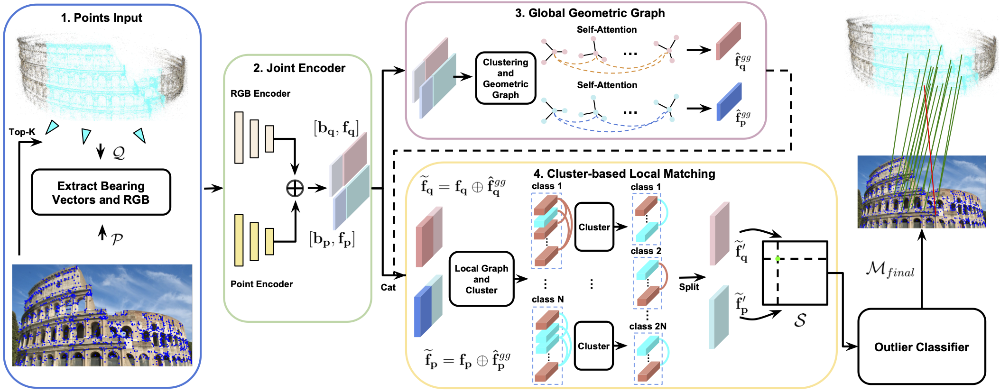

# [CVPR 2024] [DGC-GNN: Descriptor-free Geometric-Color Graph Neural Network for 2D-3D Matching](https://arxiv.org/abs/2306.12547)

Authors: [Shuzhe Wang](https://ffrivera0.github.io), [Juho Kannala](https://users.aalto.fi/~kannalj1/), [Daniel Barath](https://scholar.google.com/citations?hl=da&user=U9-D8DYAAAAJ&view_op=list_works&sortby=pubdate)

##### Abstract

Matching 2D keypoints in an image to a sparse 3D point cloud of the scene without requiring visual descriptors has garnered increased interest due to its low memory requirements, inherent privacy preservation, and reduced need for expensive 3D model maintenance compared to visual descriptor-based methods. However, existing algorithms often compromise on performance, resulting in a significant deterioration compared to their descriptor-based counterparts. In this paper, we introduce DGC-GNN, a novel algorithm that employs a global-to-local Graph Neural Network (GNN) that progressively exploits geometric and color cues to represent keypoints, thereby improving matching accuracy. Our procedure encodes both Euclidean and angular relations at a coarse level, forming the geometric embedding to guide the point matching. We evaluate DGC-GNN on both indoor and outdoor datasets, demonstrating that it not only doubles the accuracy of the state-of-the-art visual descriptor-free algorithm but also substantially narrows the performance gap between descriptor-based and descriptor-free methods.

##### Pipeline

For keypoints from the 2D image and 3D points from the point cloud, the proposed DGC-GNN (1) considers the bearing vectors and the color at each bearing vector as input. (2) It extracts the point-wise position and color features with two separate encoders and mixes the features. (3) The bearing vectors are clustered into K groups, and geometric graphs are built upon the clusters to extract the global-level geometric embeddings. (4) We then concatenate the global-level geometric embeddings with features from step 2 and build a local graph at each point as self-attention. A cluster-based attention module is adopted to enhance the local features by forcing the message to pass only with the most related features. A differentiable layer matches and optimizes the improved features to obtain score matrix S. Finally, an outlier rejection network is applied to prune the matches with low confidence, leading to the final 2D-3D correspondences.



##### Updated results On Cambridge

We provide additional results on  Cambridge with outlier rejection threshold = 0.7 when k=10  ,  we observe better performance with this setting. 

| Median Error (cm / deg)   | King's College | Old Hospital  | Shop Facade  | St Mary's Church |
| ------------------------- | :------------: | :-----------: | :----------: | :--------------: |
| rejection threshold = 0.7 | **17 / 0.41**  | **36 / 0.92** | **9 / 0.96** |  **55 / 1.52**   |


## Environment Setup

```
git clone git@github.com:AaltoVision/DGC-GNN-release.git
cd DGC-GNN-release
conda env create -f environment.yml
conda activate dgc-gnn
```

We need to install the corresponding ```torch_scatter=2.0.8```

```
wget https://data.pyg.org/whl/torch-1.8.0%2Bcu111/torch_scatter-2.0.8-cp37-cp37m-linux_x86_64.whl
pip install torch_scatter-2.0.8-cp37-cp37m-linux_x86_64.whl
```

Now install DGC-GNN

```
pip install . --find-links https://data.pyg.org/whl/torch-1.8.0+cu11.1.html
```
## Data Preparation
We provide the processed MegaDepth training data [here](https://drive.google.com/drive/folders/1ae8CHU42wTJleRrlG9GBY4V-PIdqsM0O?usp=sharing). Considering download and put it to ```/data```
## Evaluation

#### Pretained model

```
# Eval on MegaDepth
sh eval.sh
```
## Training
```
# Train on MegaDepth
sh train.sh
```

## Acknowledgements
We appreciate the previous open-source repository [GoMatch](https://github.com/dvl-tum/gomatch).

## License
Copyright (c) 2023 AaltoVision.

This code is released under the MIT License.

## Citation
Please consider citing our papers if you find this code useful for your research:
```
@article{wang2023dgc,
  title={DGC-GNN: Descriptor-free Geometric-Color Graph Neural Network for 2D-3D Matching},
  author={Wang, Shuzhe and Kannala, Juho and Barath, Daniel},
  journal={arXiv preprint arXiv:2306.12547},
  year={2023}
}
```
